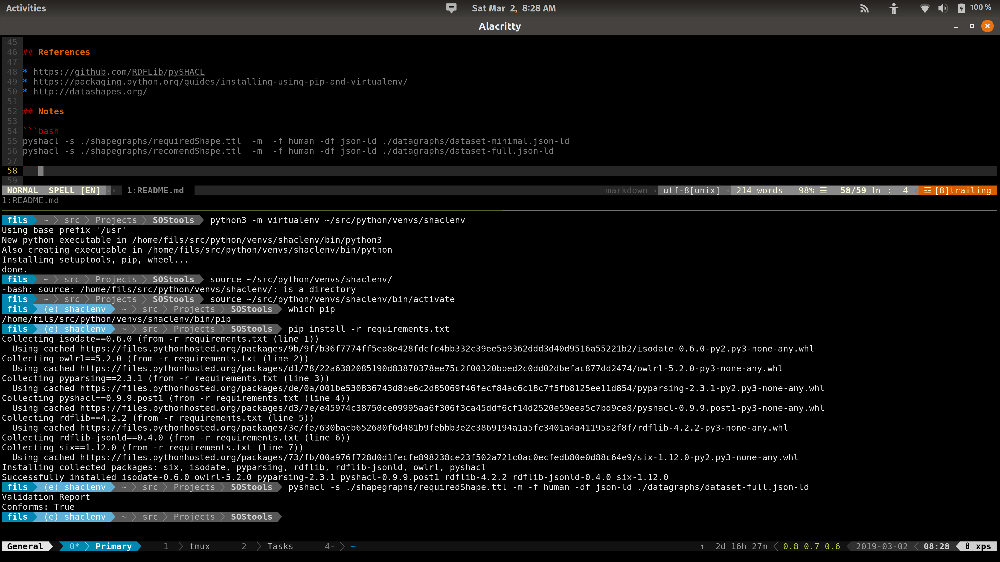

# GeoShapes

This is a test.  We are using the puSHACL ( https://github.com/RDFLib/pySHACL ) library
and wrapping it in Flask and exposing it via Google Cloud Run to provide an online 
SHACL validation that can be part of an automated work flow.  

This is also a test of using shape graphs to help define validation goals for 
data graphs.  Especially those using schema.org and extensions to publish
metadata around data sets following FAIR data patterns ( http://www.copdess.org/enabling-fair-data-project/ ).  

## Tangram:  Simple service example


The Tangram services is a web services  wrapper around the pySHACL
(https://github.com/RDFLib/pySHACL) package.  It allows you to send in JSON-LD data 
graphs to test against a Turtle (ttl) encoded shape graph.

Invoke the tool with something like:

With httpie client:

```bash
http -f POST https://tangram.gleaner.io/uploader  datagraph@./datagraphs/dataset-minimal-BAD.json-ld  shapegraph@./shapegraphs/googleRecommended.ttl format=human
```

Or with good old curl (with format set to huam):

```bash
curl -F  'datagraph=@./datagraphs/dataset-minimal-BAD.json-ld'  -F  'shapegraph=@./shapegraphs/googleRecommended.ttl' -F 'format=human'  https://tangram.gleaner.io/uploader
```

## Test Driven Graph Development

This is the start of working to explore a test driven model development
approach to working with schema.org and extensions.

The goal is to use SHACL to define our goals as constraint and then
test our graphs against this constraint.  

As an initial test we are using the Google required and recommend elements
for schema.org/DataSet at https://developers.google.com/search/docs/data-types/dataset

## Set up a Python Env with pySHACL (see refs)

A requirements.txt provides all the needed pip installs.  The following
should work to set up a new environment for you.  You can also simply install 
these into your main python3 installation if you wish.

```bash
# before 15.1.0
virtualenv --no-site-packages --distribute .env &&\
source .env/bin/activate &&\
pip install -r requirements.txt

# after deprecation of some arguments in 15.1.0
virtualenv .env && source .env/bin/activate && pip install -r requirements.txt
```

Then to activate / deactivate use the following

* source shaclvenv/bin/activate
* deactivate

A full process of setting up this approach is below.  Here I have used 
a directory in my ~/src/python/venvs to house all my various virtual environments. 

```bash
> python3 -m virtualenv ~/src/python/venvs/shaclenv
Using base prefix '/usr'
New python executable in /home/fils/src/python/venvs/shaclenv/bin/python3
Also creating executable in /home/fils/src/python/venvs/shaclenv/bin/python
Installing setuptools, pip, wheel...
done.
> source ~/src/python/venvs/shaclenv/bin/activate
> which pip
/home/fils/src/python/venvs/shaclenv/bin/pip
> pip install -r requirements.txt
[ ...  pip install output removed ... ]
Installing collected packages: six, isodate, pyparsing, rdflib, rdflib-jsonld, owlrl, pyshacl
Successfully installed isodate-0.6.0 owlrl-5.2.0 pyparsing-2.3.1 pyshacl-0.9.9.post1 rdflib-4.2.2 rdflib-jsonld-0.4.0 six-1.12.0

now test this

> pyshacl -s ./shapegraphs/googleRequired.ttl -m -f human -df json-ld ./datagraphs/dataset-full.json-ld
Validation Report
Conforms: True
```




## On owl:imports

I was hoping to leverage some import method to allow us to have various shape graphs we could composite 
into a collection of constraints easily.  While this may still be possible, my initial pattern is not 
and the reqrec.ttl file in the shapes directory will not work.   

Ref: https://github.com/RDFLib/pySHACL/issues/18

## References

* https://www.w3.org/TR/shacl/
* https://github.com/RDFLib/pySHACL
* https://packaging.python.org/guides/installing-using-pip-and-virtualenv/
* http://datashapes.org/
* https://github.com/geological-survey-of-queensland/gsq-sample-profile/blob/master/shapes/sample.ttl
* https://developers.google.com/search/docs/data-types/dataset#dataset 


## Notes

Example commands:
```bash
pyshacl -s ./shapegraphs/requiredShape.ttl  -m  -f human -df json-ld ./datagraphs/dataset-minimal.json-ld
pyshacl -s ./shapegraphs/recomendShape.ttl  -m  -f human -df json-ld ./datagraphs/dataset-full.json-ld

```

Example output
```
pyshacl -s ./shapegraphs/recomendShape.ttl  -m  -f human -df json-ld ./datagraphs/dataset-full.json-ld
Validation Report
Conforms: True

pyshacl -s ./shapegraphs/recomendShape.ttl  -m  -f human -df json-ld ./datagraphs/dataset-minimal.json-ld
Validation Report
Conforms: False
Results (1):
Constraint Violation in MinCountConstraintComponent (http://www.w3.org/ns/shacl#MinCountConstraintComponent):
Severity: sh:Violation
Source Shape: [ sh:maxCount Literal("1", datatype=xsd:integer) ; sh:minCount Literal("1", datatype=xsd:integer) ; sh:path <http://schema.org/citation>  ]
Focus Node: [  ]
Result Path: <http://schema.org/citation>
```

Use fencepull command to get the JSON-LD and feed through Tangram. 

```
curl -s https://fence.gleaner.io/fencepull?url=http://opencoredata.org/doc/dataset/b8d7bd1b-ef3b-4b08-a327-e28ei \
1420adf0 | curl -F  'datagraph=@-'  -F  'shapegraph=@./shapegraphs/googleRequired.ttl' -F 'format=human'  https://tangram.gleaner.io/uploader

```

```
xmllint --xpath "/urlset/url/loc/text()" test.xml > out

curl -s http://opencoredata.org/sitemap.xml  | grep -o '<loc>.*</loc>' | sed 's/\(<loc>\|<\/loc>\)//g' | head -3

curl -s http://opencoredata.org/sitemap.xml  | grep -o '<loc>.*</loc>' | sed 's/\(<loc>\|<\/loc>\)//g' | sed -n "100,110p"


```


